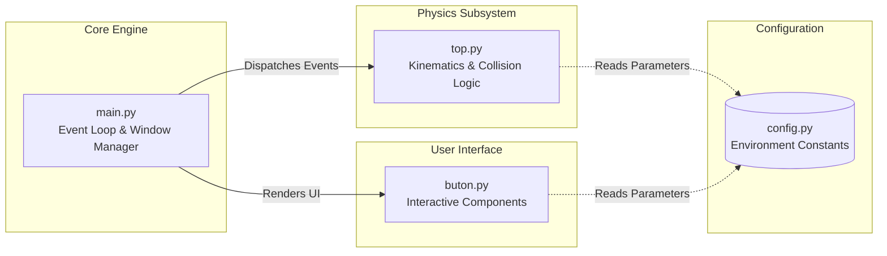

<h1 align="center">Ball Animation Game</h1>

  <i>A lightweight, high-performance Python application engineered to deliver physics-based animations and responsive user interactions within an isolated graphical environment.</i>
</p>

<p align="center">
  <a href="https://www.python.org/"></a>
  <a href="https://github.com/psf/black"></a>
  <a href="https://opensource.org/licenses/MIT"></a>
</p>

> [!NOTE]
> This repository contains a fully functional local prototype. It is designed with cross-platform compatibility in mind, ensuring seamless execution across any operating system supporting the Python runtime environment.

---

## Quick Access

| Section | Description |
| :--- | :--- |
| **[Architecture Overview](#architecture-overview)** | System modules, subgraphs, and data flow mechanics |
| **[Infrastructure Initialization](#infrastructure-initialization)** | Environment setup and dependency resolution |
| **[Execution Protocol](#execution-protocol)** | Startup commands and hardware interaction mechanics |
| **[Development Standards](#development-standards--ci)** | Static analysis, code formatting, and CI pipelines |

---

## Architecture Overview

The system is engineered utilizing a strictly decoupled, modular architecture. This design isolates the primary event loop, the physics calculation engine, user interface components, and state configurations to guarantee high maintainability and extensibility.



<details>
<summary><strong>Explore Module Responsibilities</strong> <i>(Click to expand)</i></summary>

| Module | Technical Responsibility |
| :--- | :--- |
| `main.py` | **Application Entry Point:** Initializes the graphical viewport, orchestrates the core execution loop at a locked framerate, and dispatches hardware interrupt events. |
| `top.py` | **Physics Engine:** Encapsulates the core entity; computes positional mathematics, velocity vectors, boundary enforcement, and elastic collision logic. |
| `buton.py` | **UI Controller:** Provisions and manages interactive interface elements and their associated event listeners. |
| `config.py` | **State Configuration:** A centralized repository defining environmental constants, including hex color palettes, dimensional boundaries, and scalar velocity parameters. |

</details>

---

## Infrastructure Initialization

### System Prerequisites
* **Interpreter:** `Python 3.8` or higher
* **Platform Agnosticism:** Fully supported natively on Windows, macOS, and Linux distributions.

### Environment Setup

**1. Instantiate an isolated virtual environment:**
```bash
python -m venv .venv
```

**2. Activate the execution environment:**
* **Windows (PowerShell):** `.\.venv\Scripts\Activate.ps1`
* **Windows (Command Prompt):** `.\.venv\Scripts\activate.bat`
* **Linux / macOS:** `source .venv/bin/activate`

**3. Install required dependencies:**
```bash
python -m pip install --upgrade pip
pip install -r requirements.txt
```

> [!TIP]
> If the current iteration of the application relies exclusively on the Python Standard Library, external dependency resolution is bypassed. The `requirements.txt` file is provisioned for future third-party module integration.

---

## Execution Protocol

To initialize the simulation, execute the primary module via your terminal interface:

```bash
python main.py
```

### Interaction Mechanics
* Upon initialization, the physics engine immediately commences the simulation, rendering the ball entity within the active viewport.
* Hardware interactions (e.g., keyboard interrupts, mouse events) are intercepted by the event loop within `main.py` and delegated to the handlers in `buton.py`.
* To mutate default environmental behaviors, rebind keys, or alter rendering parameters, modify the declarative variables located in `config.py`.

---

## Development Standards & CI

We strictly adhere to enterprise-grade code hygiene and formatting protocols. All contributions must align with the following workflow:

1. **Branching Strategy:** Implement changes utilizing the standard `Fork -> Feature Branch -> Pull Request` methodology.
2. **Code Formatting:** All commits must be rigorously formatted utilizing [Black](https://github.com/psf/black) to ensure syntactical uniformity.
3. **Static Analysis:** The codebase must successfully pass linting evaluations via `flake8` or `ruff` prior to Pull Request submission.
4. **Commit Hygiene:** Maintain atomic, easily verifiable commits accompanied by declarative, imperative-mood commit messages.

### Issue & Pull Request Guidelines
When submitting a Pull Request or logging an Issue, you must provide the following telemetry:
* A comprehensive description of the observed anomaly or proposed feature.
* Deterministic steps to reproduce the exact state or failure.
* An explicit comparison between the expected output and the actual system behavior.

<br>

<div align="center">
  Distributed under the <strong>MIT License</strong>.
</div>
